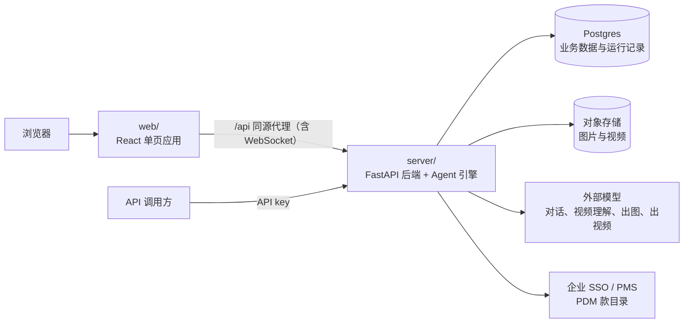

# Productor — iclip-studio

Productor 是一款 AI 视频创作产品，用来做商品短视频。用户在网页上和 AI agent 对话：先拆解一条参考视频，再写出分镜和每个镜头的提示词，然后生成镜头图片和视频，最后剪辑、合成出成片。本仓库包含它的后端与 Web 前端。

## 项目背景

创作以团队方式进行：一次视频创作要求记成一张需求单，下发后由成员认领；成员开一段对话就是一次创作尝试，由 AI 完成从拆解到出片的过程。做好的成片收进资料库，下次可以照着做同款。

| 功能 | 说明 |
|---|---|
| 对话创作 | 选一个 agent 开始对话，如 AI 导演。agent 拆解参考视频、写分镜和提示词，再调用模型出图、出视频；有哪些 agent 由部署方在配置里声明 |
| 分镜与制作页 | 查看和修改 agent 写下的分镜与提示词，逐个镜头生成图片和视频 |
| 编辑图片和视频 | 修改图片，剪辑视频片段，把几段视频合成一条成片 |
| 创作需求单 | 记录视频规格、商品信息、参考素材和创作说明；下发后可多人认领 |
| 资料库 | 全站的成片和参考视频，可以照着做同款 |
| 审计 | 治理者查看产量、成功率、耗时和模型用量 |
| 开放接口 | 网页上能用的功能同样开放给 API key 调用；另提供按商品品类、品牌查找同类爆款视频的接口 |

业务术语与规则见 [docs/CONTEXT.md](docs/CONTEXT.md)。

## 项目架构

| 目录 | 内容 |
|---|---|
| `server/` | 后端：Python FastAPI 模块化单体，Agent 引擎基于 PydanticAI |
| `web/` | 前端：Vite + React 单页应用，使用 TanStack Router、TanStack Query 和 Tailwind CSS |
| `contract/` | 后端导出的 OpenAPI 合同，以及它表达不了的跨端约定 |
| `deploy/` | 单机部署用的 docker compose 文件 |
| `docs/` | 业务术语、后端架构、架构决策（ADR）、测试规范、启动部署与发版文档 |

### 后端

后端代码在 `server/src/iclip/`，按职责分层，由 `app/` 统一读取配置、装配各模块并管理启停：

| 目录 | 职责 |
|---|---|
| `domains/` | 业务模块：身份与权限、对话、生成任务、需求单、资料库、参考视频、审计等 |
| `harness/` | Agent 运行框架：装配 agent、驱动运行、保存消息、压缩上下文 |
| `capabilities/` | 给模型调用的工具：读写工作区文件、拆解视频、取帧出图、AI 导演的工程文件 |
| `platform/` | 共用的技术适配：数据库、对象存储、ffmpeg 媒体处理等 |
| `app/` | 组合根：读取配置、创建连接、装配模块 |

几项贯穿全局的设计：

- **agent 靠配置声明**：每个 agent 用哪个模型、提示词、skill 和工具，都写在部署方的 `agents.yaml` 与 `config.yaml` 里，这两份配置不进仓库，修改后保存即生效。
- **对话运行不依赖浏览器连接**：消息先进 Postgres 队列，再由后端执行，关掉页面不会中断运行；运行过程经 WebSocket 实时推给前端。
- **生成走后台队列**：出图、出视频提交给外部模型，由后台队列跟踪结果；剪辑、合成与抽帧在服务端用 ffmpeg 完成，能用硬件编解码时优先用硬件。
- **用户与机器共用一套权限**：浏览器用户经企业 SSO 或密码注册登录，机器调用方使用 API key，两者按同一套角色与权限授权。

分层边界、配置装配、持久化与运行机制见[后端架构](docs/architecture.md)。

### 前端

前端按业务模块组织页面，接口类型与校验从后端导出的 OpenAPI 合同生成，不手写。目录职责与开发约定见 [web/AGENTS.md](web/AGENTS.md)。

## 文档

本地启动、部署与升级见 [docs/deploy.md](docs/deploy.md)；其余文档的入口见 [AGENTS.md 的文档地图](AGENTS.md#文档地图)。
